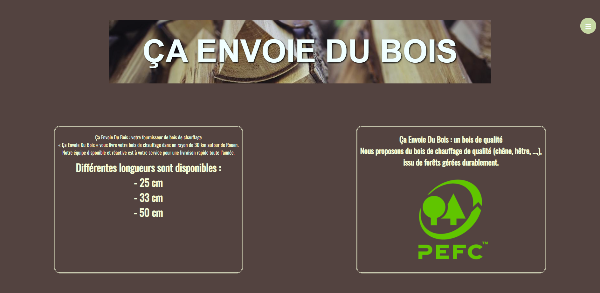
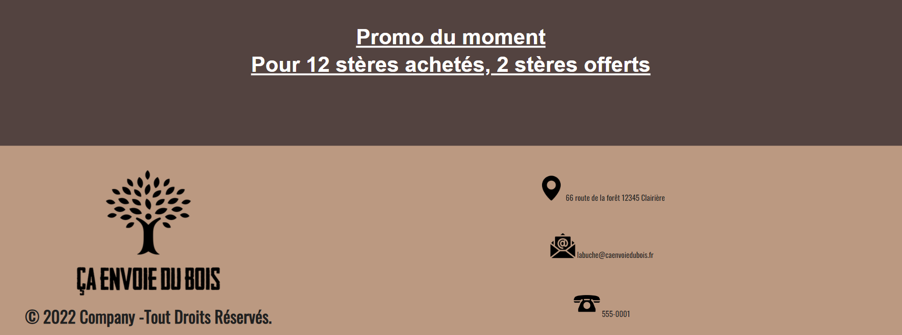
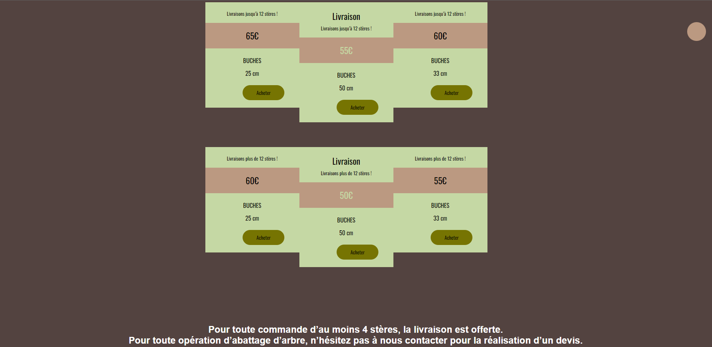
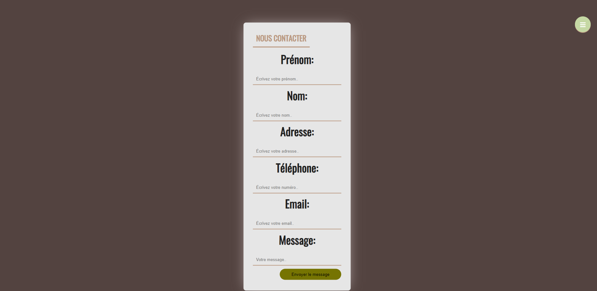
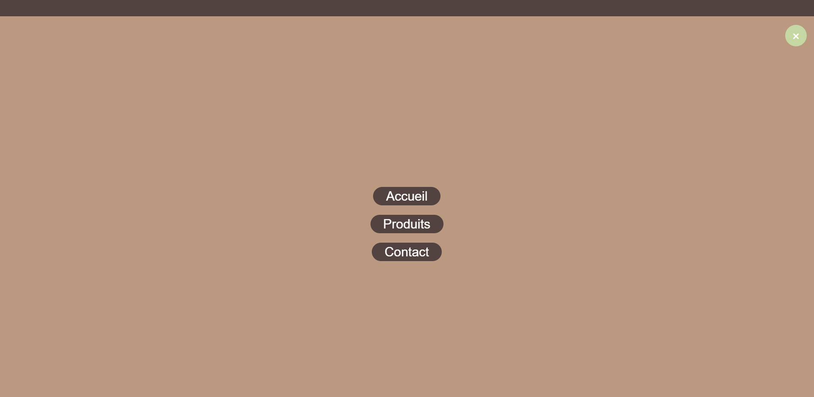

# Description
"Ça envoi du bois" est un site web d'une entreprise imaginaire qui propose une variété de produits en bois. Le site comprend trois pages principales :

* Page d'accueil : cette page affiche les annonces et les promotions en cours.

* Page de produits : cette page présente tous les produits disponibles, classés par catégories. Chaque produit est accompagné d'une description détaillée et d'une photo.

* Page de contact : cette page permet aux visiteurs de contacter l'entreprise par le biais d'un formulaire de contact.

* Page de Menu : cette page me permets de passer d'une page à l'autre grace à mon menu

# Technologies utilisées:
* HTML
* CSS
* JavaScript

# Comment utiliser le site
Pour accéder au site, vous pouvez simplement ouvrir le fichier index.html dans votre navigateur web préféré.

# Contributions
Les contributions à ce projet sont les bienvenues ! Si vous souhaitez apporter des améliorations ou corriger des bugs, n'hésitez pas à ouvrir une pull request.

# Auteurs
Ce projet a été réalisé par Marina ASHRAF MORIS dans le cadre d'un projet personnel.

# Licence
Ce projet est sous licence MIT.